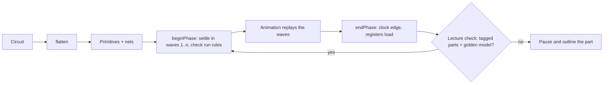

# Z18 Builder

**A visual CPU builder: wire up gates, MUXes, registers and RAM into the 18-100 Z18100 lecture machine, then run real programs and watch every signal propagate.**


---

## What you can do

- **Place and wire parts**, from logic gates up to PC, IR and RAM. Wires drawn without bends are routed automatically by an A\* router, and **Tidy** (`w`) reroutes a messy selection, or the whole level, in one undo step.
- **Pack your circuits into reusable parts** (`p`), and open any built-in to see how it is made, from the ALU down to its full adders.
- **Run programs** with a speed dial (0.05×–7×) and wave-by-wave animation. Step one wave, one clock phase or one instruction, or run to the end, and step back a phase at any time.
- **15 guided missions** in three groups: basic parts (full adder up to the ALU, decoder and MUX), then memory (SR latch, D latch, D flip-flop, register), then the full machine (fetch, loads, MUX/DEMUX, store, jump).
- **Truth and step tables**, plus error messages that explain *why* something is wrong and *how* to fix it ("R2.d comes from the data bus ... M[5] was never set").


<sub>[Longer version of the wiring demo](ZBuilder18%20Media/wiring%20%28long%20version%29.gif)</sub>


---

## The lecture check

Your build is checked **phase by phase, in lockstep, against a golden-model simulator** of the Z18100 (`z18100/z18_cpu.py`). After every clock phase, each tagged part of your machine (IR, PC, R0–R3, MUX reg, A, B, Output, flags, RAM) is compared with the reference. At the first difference, the run pauses and outlines the part that went wrong, so you see exactly where your CPU diverges, not just that the final answer is off. Press `w` to have it trace the bad value back to its cause.

You tag parts yourself (select one and press `t`), so the check works on any machine you build, not just the stock layout.


---

## How it works

The simulator works on **whole nets** (a group of joined wires). A net carries an integer, `Z` (nothing drives it) or `X` (unknown: uninitialized memory, a bus conflict, or garbage in). A circuit with parts inside parts is first flattened into primitives joined by nets. Each clock phase then runs in two steps, mirroring the golden model: the logic is **settled in zero-delay waves** (each wave updates the parts whose inputs just changed), and then the **clock edge commits** every register at once. Settling is incremental, so each phase starts from the last settled values and only what changes moves. The wave numbers of those changes are what the animation plays back.

**Gate loops are supported.** Loops are found with an iterative Tarjan's algorithm, so a latch built from cross-coupled gates starts at `X` and resolves naturally once it is set. A ring or race that never settles goes to `X` and is named in its cycle order.

The code keeps a strict **model/view split**:

| Layer | Files | Role |
|---|---|---|
| Model (no graphics) | `zb_values`, `zb_parts`, `zb_circuit`, `zb_sim`, `zb_library`, `zb_kit`, `zb_missions`, `zb_explain`, `zb_route` | Values, parts, circuits, simulation, user parts, the lecture machine, missions, explanations, routing |
| View / controller | `zb_editor`, `zb_view`, `zb_paint`, `zb_main` | Build-mode actions, drawing, the rendering backend, app setup, modes, animation and events |
| Reference | `z18100/` | The ISA table, the assembler and the golden-model CPU |

Because the model never imports graphics, the whole test suite runs without opening a window.

See [Z18 Builder Architecture](Z18%20Builder%20Architecture.md) for the full design.



---

## Getting started

Developed and tested on **Python 3.14** with **cmu-graphics 2.0**.

```
pip install cmu-graphics
python z18builder/zb_main.py
```

Run it from the repository root. The app opens your last circuit (`z18builder/circuits/autosave.json`), or the lecture machine on first launch. **Open** (`ctrl+O`) also offers the lecture machine, an empty canvas and anything you have saved.

To run a sample program:

1. Press `Tab` to switch to Run mode.
2. Press `l` to pick a program. Samples are in `z18100/programs/` (`fibonacci.z18`, `max.z18`, `flags.z18`, `self_modify.z18`, …) and `z18builder/programs/`.
3. Press `r` to run or pause, `space` to step one instruction, `p` for one phase and `n` for one wave. Use `+` / `-` for speed, and `?` for all the keys.

To run the tests (no window needed; all 68 pass):

```
python z18builder/test_zb.py
```


---

## The Z18100 machine

| | |
|---|---|
| Data word | 8 bits (`[7:4]` op code, `[3:0]` operand) |
| Address | 4 bits |
| Memory | 16-word RAM |
| Registers | R0–R3, A, B, MUX reg, Output, PC, IR, flags (N, Z, O) |
| Instructions | 10: `Move`, `Load R1/R2/R3`, `MUX`, `DEMUX`, `Add`, `Sub`, `Jump-if-not-negative`, `Store` |
| Clock | Two phases per instruction: fetch, execute |

The Z18100 is the teaching CPU from CMU's **18-100** (Introduction to Electrical and Computer Engineering). The simulator, assembler, builder and everything in this repository are my own implementation of it.

A machine you build can also go beyond the lecture's: give the decoder more outputs, wire up a spare one, and declare the new instruction at the top of a program (`.instruction 1010 Jump x = PC <- x`).

---

## Known limitations and roadmap

- **Frame rate.** Run mode on the full lecture machine takes about 19 ms per frame (~53 fps) with the default renderer, just short of the 60 fps target (16.7 ms). Most of that is drawing. To measure it yourself, run `ZB_BENCH=1 python z18builder/zb_main.py`, and add `ZB_PROFILE=20` for a profile.
- **Display scaling.** Windows display scaling at 150% hasn't been verified yet.
- **Values are whole-net.** `Z` and `X` apply to a whole bus, not to single bits, so a word-wide latch can only leave `X` when all its bits are set together.
- **Next up:** a logic analyzer, for watching chosen signals over many cycles as waveforms.
