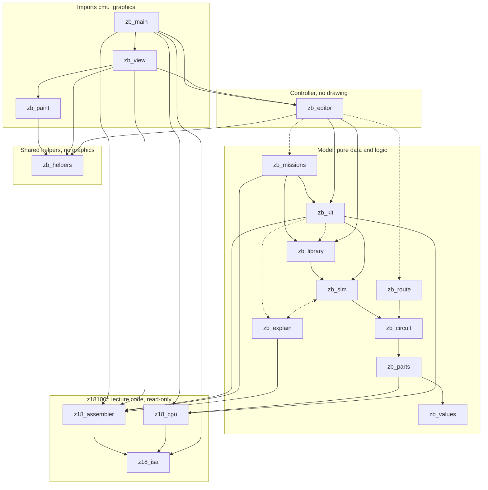
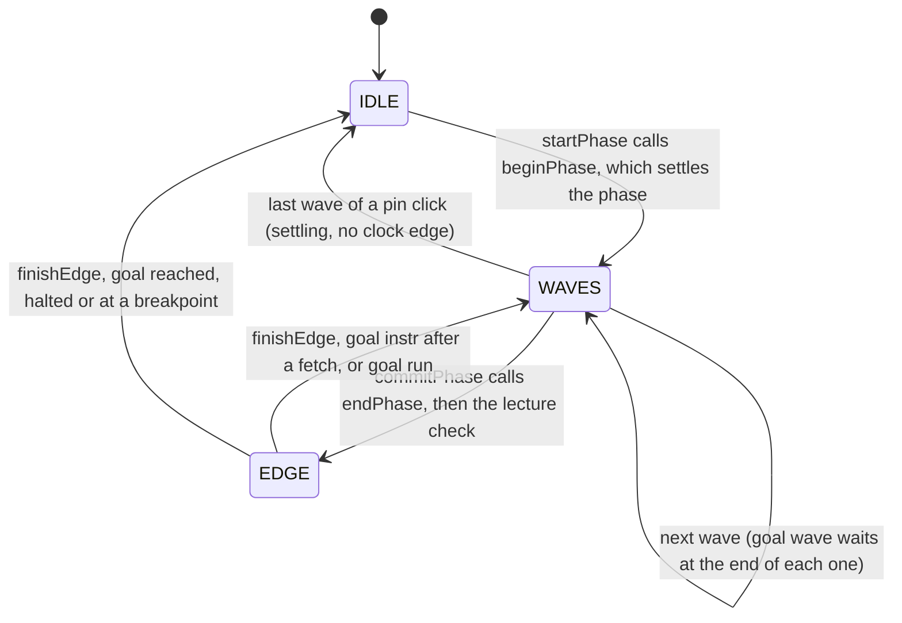

# Z18 Builder Architecture

Z18 Builder is a teaching app for CMU 18-100's Z18100, an 8-bit CPU with 16 words of memory. Students wire a computer from parts, run a `.z18` program on it, and watch the logic settle wave by wave. At each clock edge, the machine they built is compared against the lecture's bit-level reference model.

- **17** Python modules (14 in `z18builder/`, 3 in `z18100/`), plus a 73-test suite
- **\~14,400** lines, not counting the tests
- **30** built-in parts
- **15** missions
- Runtime: **cmu_graphics** on pygame

1. [Layers and who imports whom](#1-layers-and-who-imports-whom)
2. [The golden model](#2-the-golden-model)
3. [Data model](#3-data-model)
4. [The simulation engine](#4-the-simulation-engine)
5. [One phase, end to end](#5-one-phase-end-to-end)
6. [Parts made of parts](#6-parts-made-of-parts)
7. [The kit and the lecture check](#7-the-kit-and-the-lecture-check)
8. [Missions](#8-missions)
9. [Explanations and routing](#9-explanations-and-routing)
10. [Rendering](#10-rendering)
11. [Controller and view](#11-controller-and-view)
12. [Persistence and caching](#12-persistence-and-caching)
13. [Module index](#13-module-index)

## 1. Layers and who imports whom

One rule shapes the code: **only three modules import cmu_graphics**: `zb_paint` (the only code that draws), `zb_view` (decides what to draw) and `zb_main` (the app and its events). Everything else is plain dicts and lists. That keeps snapshots, JSON files and undo cheap, and lets the model run without a window (mission checks, verification, the test suite). `zb_editor` is part of the controller, but it never draws, so the tests drive it with a stand-in app object.



**Arrows point from the importer to the module it imports, and at module level they only point down:** graphics, then controller, then model, then lecture code. Solid arrows are imports at the top of the file; dotted arrows are imports inside a function. Not every import is drawn: `zb_main` and `zb_view` read from most of the model, and an arrow already implied by a longer path is left out. The one loop, between `zb_sim` and `zb_explain`, is made of imports inside functions on both sides, so neither module needs the other to load. `zb_helpers` (display scaling and polyline geometry) imports nothing from the builder, so any layer may use it.

The builder reaches `z18100/` by appending it to `sys.path` (at the top of `zb_parts`, `zb_kit`, `zb_main` and `test_zb`). It never modifies those files. The style is the same throughout: no classes, camelCase names, a short comment on every function, and `#####` section banners.

## 2. The golden model

`z18100/z18_cpu.py` simulates the lecture's CPU down to single bits. Memory is 16 × 8 bits, where `None` means uninitialized (`xxxxxxxx`). The registers are `pc`, `ir`, `r0`–`r3`, `muxReg`, `a`, `b` and `out`, plus the flags `n z o`. It follows [`z18100/z18100_cpu_spec.md`](z18100/z18100_cpu_spec.md), a written specification of the machine taken from lectures 06 and 07.

- **Two phases per instruction.** In *fetch* (CLK = 0) the PC drives the address bus and `IR ← M[PC]`. In *execute* (CLK = 1), `IR[3:0]` drives the address bus and a 4→10 decoder turns `IR[7:4]` into control lines.
- **Built from gates.** `notGate`, `andGate`, `xorGate`, `transmissionGate`, `fullAdder`, `runAdder` (ripple carry, with XOR inversion to subtract), `runMux` and `decoderOutput`.
- **Compute, then commit.** `computeSignals(cpu)` works out every wire for the next phase without changing anything. `stepPhase` commits it, which is the clock edge.
- **Stops.** The machine halts when the PC passes 15, when the IR holds `xxxxxxxx`, or on an undefined op code (10–15). It stops with an error when any latch would load `xxxxxxxx`.

The instruction set is one table in `z18_isa.py`: each op code with its lecture syntax, its short form for the RAM table and a description. The CPU and the assembler both read it, so changing an instruction means changing one row. A program can also declare extra instructions (`.instruction 1010 Jump x = PC <- x`) for a machine built with a bigger decoder.

`z18_assembler.py` turns lecture-syntax assembly (`Load R2, M13`, `MUX R3`, `Jump-if-not-negative M1`, raw words, `data -3`, `13:` address prefixes) into 16 words, and disassembles words for the RAM table and the narration. Six demo programs live in `z18100/programs/`: `lecture_loop`, `fibonacci`, `flags`, `max`, `self_modify` and `uninit_error`.

## 3. Data model

### Values

A net is a group of connected wires. It carries an int from `0` to `2^width − 1`, `Z` (nothing drives it) or `X` (unknown). `Z` and `X` apply to the **whole net**, never to single bits. That's much simpler, at one cost: an 8-bit latch built from gates only stops being `X` once every bit is known.

### Primitive parts

Each of the 30 built-ins in `zb_parts.py` is a definition dict. The Z18100 parts call the golden model's own functions (`runAdder`, `runMux`, `decoderOutput`), so they can't drift from the lecture's behaviour.

| Field | What it does |
| --- | --- |
| `name`, `label`, `level`, `shape` | Identity, palette tab (0 gates, 1 blocks, 2 units), and which drawing routine the view uses |
| `params` | Defaults such as `width`, `inputs`, `ranges`, `widths` |
| `layout(params)` | Returns `(w, h, ports)`, each port `{name, dir, width, dx, dy}` |
| `evaluate(params, inputs, state)` | Combinational behaviour. Handles unknowns: a known 0 decides an AND even when other inputs are `X`; a MUX ignores inputs it didn't select; a floating input reads as `X`. |
| `initState`, `commit`, `problem` | Stateful parts only: starting state, next state at the clock edge, and whether that edge would store `X` |
| `tristate` | Output ports that may float (TG `out`, RAM `dout`, DEMUX `f0`/`f1`). Only these may share a bus. |

State takes several shapes: an int for registers, a 16-item list for RAM, an `{n, z, o}` dict for Flags, and 0/1 for the clock. `copyState` handles all of them. The module also parses bus notation (`7:4 3:0`, `bits`, `nibbles`, `4 4`, `1x8`) and validates parameters.

### Circuits

A circuit is plain JSON-ready data, so saving, undo and copy/paste are just serialization:

```
circuit  = {name, parts[], wires[], junctions[], nextId}
part     = {id, type, x, y, params, label, ref, mode}     # ref: golden-model tag, mode: 'fast' | 'detailed'
wire     = {id, a: end, b: end, via: [[x, y], ...], color, lamp}   # via [] means "route it automatically"
end      = ['port', partId, portName]  |  ['junction', junctionId]
library  = {user: {name: compositeDef}, recipes, recipeStates, version, cache}
```

`zb_circuit.py` provides:

- Cached layouts, including composite boxes whose ports are spread around the sides by each pin's `side` and `order`.
- Nets, computed with union-find.
- `validate`: width mismatches (each with the one part that fixes it), two drivers on one net, floating inputs.
- `checkNewWire`: refuses a bad wire before it's added.
- Junction clean-up.
- `wireGeometry`: crossings with hop paths, overlaps, branch dots, and wires under parts. It runs once per edit, never per frame.

## 4. The simulation engine

### Flattening

`flatten(library, circuit)` turns a nested circuit into a flat **sim**: a list of primitive instances (`prims`), each identified by its `path` (part ids from the top), and a list of `nets`, each with drivers, readers, a value, and one value per driver.

- A pin inside a user part is joined (union-find) to that part's outer port, so the hierarchy disappears. Nesting stops at 12 levels, which also catches a part that contains itself.
- A verified, stateless user part set to `fast` runs as its built-in twin.
- An iterative Tarjan search finds loops of logic, ignoring paths through registers. Each loop is recorded, because a loop of gates is either a latch or an oscillator.

### Settling, wave by wave

`settle(sim)` is event-driven. It starts from the prims whose inputs or state changed (the *seeds*), evaluates them, resolves each net they touched (floating drivers are ignored; two real drivers give `X`), and queues the readers of any net whose value changed. Each round of this is a **wave**. The sim records the wave in which each net changed (`netWave`), and the animation replays exactly those numbers.

If waves keep going past `4 × prims + 10`, the loop that is still changing has its outputs forced to `X`, and the sim explains why. An odd number of inverting gates makes a **ring oscillator**; an even number means a **latch race**, such as releasing S and R together.

### Clock phases

Like the golden model, each phase is computed first and then committed. `beginPhase` sets the clock, settles, works out what every register would load, and runs the stop checks in order: loop error, the kit's halt rules, bus contention, then loading `X`. `endPhase` is the clock edge: every register loads at once, or the machine halts. The model has zero delay.

### History

Each phase saves a snapshot of every prim's state. If the circuit has gate loops, the snapshot also keeps net values, because a latch built from gates stores its bit on its wires. `goToStep(k)` restores state *k−1*, settles phase *k* so the wires show what they carried during it, then restores state *k* so the registers show what they loaded at its edge.

## 5. One phase, end to end

Run mode replays a phase that has already been computed: the sim settles it, then the UI animates its waves, then the clock edge commits it. `app.stage` records where the animation is (`IDLE`, `WAVES` or `EDGE`), and `app.goal` (`wave`, `phase`, `instr` or `run`) records how far the user asked it to go.



**The machine changes only in `commitPhase`; everything else replays a settled result.** Space sets the goal to `instr`, so after a fetch edge it loops straight back into `WAVES` for execute. Pause sets `app.frozen`, which stops all three states where they are. **To end** (`e`) skips the animation and calls `beginPhase` and `endPhase` in a plain loop.

Clicking an IN pin or a truth-table row also enters `WAVES`, with `settling = True`. Those waves animate the logic but never reach a clock edge. A circuit with no CLOCK runs in **logic mode**: it settles at once, the truth table opens on the side, and Run plays the table one row at a time.

Animation timing follows the wall clock, not the number of frames drawn (`elapsedFrames`), so a slow frame on a big machine doesn't slow the playback. At 1× speed a wave takes 14 frames, and the speed dial runs from 0.05× to 7×.

## 6. Parts made of parts

A user part is a composite definition: `{name, circuit, implements, verified, stateful, size, …}`. Its ports are the IN and OUT pins inside its circuit. `zb_library.py` handles them:

- **Packing** (`packSelection`) moves the selected parts and their internal wires into a new circuit. It adds one pin for each net that crosses the edge of the selection: an output if something inside drives it, otherwise an input, with the net's width. It then puts one instance in place of the selection and rewires it.
- **Testers** are flattened sims whose input pins act as switches. Truth tables, verification, mission checks and looking inside a primitive are all built on them.
- **Verification** first checks the part's pins match the built-in's ports. If they don't, it explains what's missing, extra or the wrong width, and suggests near-miss names ("did you mean cin?"). It then compares outputs against the built-in's own `evaluate`: every input when there are 16 bits or fewer, otherwise 7 edge values and 2,000 random vectors from a fixed seed (18100). Passing unlocks fast mode.
- **Stateful parts** (a register, RAM, or a gate loop anywhere inside) can't have a truth table and never run fast. Memory missions check them with step tables instead.
- **Looking inside while running** (`innerView`): a user part that was flattened shares the live sim at a path prefix, so the animation runs inside it too. A built-in shows its recipe in a one-off tester, fed the part's current port values and its stored state. Opening the PC, for example, shows its COUNTER holding the PC's value.

## 7. The kit and the lecture check

`zb_kit.py` connects the generic engine to the specific lecture machine.

- **Tags** (`ir`, `pc`, `r0`–`r3`, `muxReg`, `a`, `b`, `out`, `flags`, `mem`) link a placed part to a field of the golden model. The halt rules and the lecture check only look at tagged parts.
- **Recipes** are read-only circuits showing what's inside each built-in, matching the golden model gate for gate. The ALU recipe, for example, is eight FULLADDs with XOR inversion, and the REG recipe is a MUX2 (WE picks: feed `q` back to hold, or `d` to load) in front of a D-FF, D flip-flops that load at every clock edge. Pressing `c` copies a recipe into an editable part. Parts without a recipe say why when opened: gates, pins and wiring are the smallest parts, and D-FF, COUNTER, RAM and CLOCK are simulated as one block. Missions 6–8 build a D flip-flop from gates.
- **Down to gates.** `expandToGates` replaces every built-in that has a recipe with a part made from it, recursively, for a test that runs programs on the machine at gate level. Registers stay whole: their D-FF is no closer to gates, and the lecture check reads the tagged registers' own state.
- **The lecture machine** is built in code by `makeReferenceMachine()`, using a small DSL (`put`, `dot`, `link('a.port', '*junction', via, lamp)`). The data bus runs along the top, the address bus under the RAM, and the decoder's rails along the bottom. It's the first-launch circuit, and missions 10–14 start from it with parts removed.
- **Halt rules** (`z18Rule`) apply the golden model's stops to the tagged PC and IR. Loading `X` into a register is an error, except into the IR, because fetching `xxxxxxxx` halts on the next phase anyway.
- **The lecture check** runs a `z18_cpu` alongside the student's machine. After each phase, `checkerStep` advances it to the same phase count and `compareWithGolden` reports the first difference: the tagged registers in a fixed order, then memory, then halt status. `goldenWhy` explains it: whether the register's WE was on, what drove its `d` input, and when the lecture machine loads that register (from the spec's sections 2.3–2.10).

## 8. Missions

The 15 missions are declarative dicts. Each one has a starting circuit, a whitelist of allowed parts, and a check. `checkMissionDetail` runs every check in the same order (wiring errors, then disallowed parts, then the mission's own check) and returns enough detail for the UI to open the table straight on the failing row.

| Kind | Missions | Starts with | Checked by |
| --- | --- | --- | --- |
| Parts | 1–5: full adder, 8-bit adder, ALU, decoder, 4:1 MUX | Pins placed | `verifyPart` against a built-in, or a Python function (`a + b + cin`) |
| Memory | 6–9: SR latch, D latch, D flip-flop, 8-bit register | Pins placed | A step table from power-on, changing one input per step so a correct latch never races |
| Machine | 10–15: fetch, loads, MUX/DEMUX, store, jump, free build | The lecture machine minus some parts (15: empty) | Programs run in lockstep with `z18_cpu` (`runAndCompare`) |

Finishing a Parts or Memory mission puts a verified copy in My parts. Progress is saved in `parts/progress.json` by mission id, so renumbering missions loses nothing.

## 9. Explanations and routing

### zb_explain

Every problem in the app has the same shape: `{level, code, text, why[], fix, parts, wires, nets, prims}`. `explainValue` follows an `x` or `Z` back through up to six steps, using the student's vocabulary: "the data bus floats: TG is off: en = 0 (from decoder output 9 (STORE))". It recognizes floating nets, contention, unwritten RAM addresses, registers that never loaded, latches never set, and unknown selects or enables. `explainOutput` walks the logic behind a wrong truth-table output and outlines the gates involved.

### zb_route

An A\* search on the 10-unit grid, where each state is `(cell, direction)`. A wire can't pass through parts or run along another net's wire, and it must leave and enter each port in the direction the port faces. Costs: 1 per cell (0.5 along its own net, so wires share trunks), 4 per bend, 6 per crossing, 1 next to a part. The search first looks within 15 cells of the two ends, then widens to the whole circuit, and gives up after 60,000 states. `tidyWires` reroutes wires one at a time, biggest net first, and makes a second pass that routes the first pass's failures first.

## 10. Rendering

All drawing goes through five functions in `zb_paint.py`: `scaledRect`, `scaledLine`, `scaledCircle`, `scaledPolygon` and `scaledLabel`, plus clipping. They take **design units**: the layout is always 1440 × 810 (16:9), scaled to fit the window and centered, with bars filling the rest. The process declares itself DPI-aware (`zb_helpers`), so text stays sharp at 125% and 150% Windows scaling.

- **Fast backend (the default).** Each frame is drawn straight onto one offscreen surface with cmu_graphics's internal renderer (`deps.wyvern`). The surface replaces a cached image, which is shown with a single `drawImage`. This avoids cmu_graphics creating one object per draw call. It needs Pillow for the one-time image it draws into.
- **Screen copy.** cmu_graphics's `App.redrawAll` is patched so pygame copies the frame without alpha blending (RGBX instead of RGBA). The code comment puts this at about 13 ms → under 1 ms per frame.
- **Fallback.** If any of these internals fail (Pillow missing, or a cmu_graphics release that changes them), the backend prints why and switches to plain `drawRect` / `drawLabel` calls. `ZB_DRAW=shapes` forces that. The app still works, just more slowly, so a cmu_graphics upgrade is the most likely cause of a sudden slowdown.

## 11. Controller and view

cmu_graphics gives the program one `app` object. `initAppFields` sets about 80 fields on it:

| Group | Fields |
| --- | --- |
| Document | `root`, `library`, `fileName`, `savedVersion`, `stash` (the circuit a mission or part sheet replaced) |
| Navigation | `path` (part ids down to the level on screen), `view`, `cams` (one camera per level), `solo` (a part running on its own) |
| Editing | `selection`, `tool` (place / wire / bus), `wireStart`, `wireVia`, `drag`, `clipboard`, `undo`, `redo` |
| Cache keys | `editVersion`, `viewVersion`, `simVersion`, `levelCache`, `flowCache`, `wireGeom` |
| Run | `sim`, `stage`, `wave`, `waveT`, `goal`, `running`, `settling`, `frozen`, `breakpoints`, `checker`, `difference`, `narration`, `logicMode` |
| Overlays | `table`, `picker`, `explain`, `showHelp`, hover fields, `message` |

### zb_editor: Build-mode actions

This module changes `app` and its circuits but never draws, so code can drive it with a stand-in app object. Its parts:

- **Camera and hit-testing.** `hitTest` checks in priority order: port, junction, part, wire.
- **Undo.** Each undo step stores the whole document as JSON text (the root circuit plus every user part), up to 100 steps. It's simple and reliable, but undo always returns to the top level.
- **Wiring.** A drag from an N-bit port to a 1-bit port places (or reuses) a SPLIT or MERGE and switches to wiring one bit per click.
- **Parameters, packing and verification.**
- **Files**, including the stash that missions and part sheets use to bring the previous circuit back.

Every edit ends in `afterEdit`, which:

1. bumps `editVersion`;
2. un-verifies and saves the user part being edited, if any;
3. re-runs validation and wire geometry;
4. autosaves to `circuits/autosave.json`.

### zb_main: the app controller

- **Startup:** turns off cmu_graphics's model/view checker (see zb_view below), builds the library, loads saved parts, then opens the autosave (or builds the lecture machine).
- **Tab into Run:** validates, flattens, attaches the kit, loads the program into the RAM tagged `mem`, and turns on the lecture check if any part is tagged.
- **The animation** shown in section 5.
- **Narration:** one sentence for each part whose output changed in the current wave, such as "MUX passes input 2 because sel = 10".
- **Pickers** (pop-up lists) for programs, files, missions, presets and verify targets.
- **Events:** mouse clicks are dispatched by screen region. Overlays come first, then breadcrumbs, the toolbar, the timeline or palette, the side panel, the warnings bar, and finally the canvas. The mouse wheel comes in through a raw pygame hook, because cmu_graphics has no wheel event.
- **Benchmarks:** `ZB_BENCH`, `ZB_SHOT` and `ZB_PROFILE` run timing, screenshot and profiling modes.

### zb_view: drawing only

- Each frame starts by copying `app`'s fields into a plain namespace, because reading cmu's `app` is slow. Camera and per-level data are cached for the frame.
- The per-level cache (`app.levelCache`) and the wire-flow cache are filled in place while drawing. cmu_graphics 2.0.5 added a check that hashes the whole app state before and after `redrawAll` and stops the program if anything changed, so `zb_main` sets `app.disableMvcChecker = True`. That also saves hashing the app state twice a frame.
- `findLevelInfo` maps each net on the level on screen to its sim net, using the view's path prefix.
- A wire is *dim*, *moving*, *lit* or *unknown*. A shortest-path search from the net's active driver makes the value spread outward along the wires, carrying a value "packet".
- Each part is drawn by a routine for its shape. The RAM is drawn as a live 16-row table with bits you can click and breakpoints.
- Hovering a part lights the parts feeding it in green and the parts it feeds in pink.

## 12. Persistence and caching

| Path | Holds | Written |
| --- | --- | --- |
| `circuits/autosave.json` | The circuit on screen; loaded at startup | On every edit |
| `circuits/<name>.json` | Saved circuits (`version: 1`) | Save, ctrl+S |
| `parts/<name>.json` | One user part: definition plus circuit | On edit, pack, verify, mission reward |
| `parts/progress.json` | Missions completed | On mission success |

`circuits/z18100_reference.json` is the one saved circuit in the repository: the lecture machine as a file, which a test keeps identical to `makeReferenceMachine()`. The autosave and `parts/` are git-ignored.

Caches are invalidated by **version counters**, not dirty flags:

- `editVersion` and `viewVersion` key the validation results, wire geometry and level info;
- `simVersion` keys the wire-flow paths;
- `library['version']` keys part layouts.

Anything expensive is computed once per edit, never once per frame.

## 13. Module index

| Module | Lines | Role |
| --- | --- | --- |
| `z18100/z18_isa.py` | 171 | The instruction table: op codes, syntax, descriptions, declared instructions |
| `z18100/z18_cpu.py` | 480 | Golden model: bit-level reference CPU |
| `z18100/z18_assembler.py` | 626 | Assembly ↔ memory words; disassembly for the UI |
| `zb_values.py` | 63 | Signal values (ints, Z, X) and formatting |
| `zb_helpers.py` | 133 | Display scaling and window size; polyline geometry for packets, hit-tests and bit lanes |
| `zb_parts.py` | 1,003 | Every primitive: ports, behaviour, state; bus notation |
| `zb_circuit.py` | 1,037 | Circuit data, nets, validation, wire geometry, JSON |
| `zb_sim.py` | 788 | Flatten, settle in waves, clock edge, history, loops |
| `zb_library.py` | 629 | User parts: pack, test, truth tables, verify, look inside |
| `zb_kit.py` | 818 | Palette, recipes, lecture machine, run rules, golden check |
| `zb_missions.py` | 649 | The 15 missions and their checks |
| `zb_explain.py` | 367 | Why a value is x / Z / wrong; stop details |
| `zb_route.py` | 360 | A\* wire router and Tidy |
| `zb_editor.py` | 1,786 | Build-mode actions, camera, undo, files |
| `zb_main.py` | 2,397 | Setup, modes, animation, events, pickers, narration |
| `zb_view.py` | 2,747 | Draws everything |
| `zb_paint.py` | 383 | Drawing backend: fast offscreen path, window scaling |
| `test_zb.py` | 2,528 | 73 tests, run without a window: `python z18builder/test_zb.py` |

`z18100/z18100_cpu_spec.md` is the written specification of the Z18100 that the golden model and the lecture check's explanations follow.
